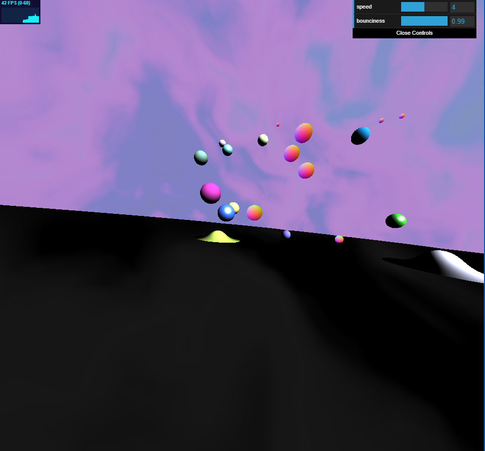
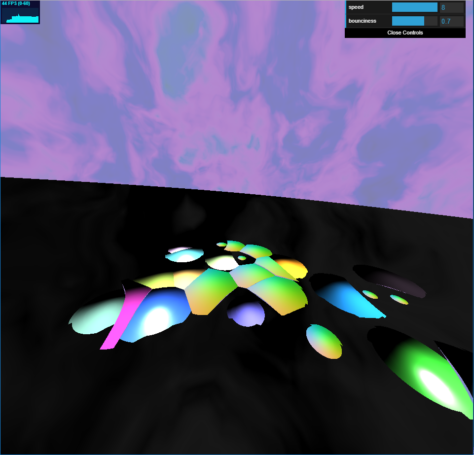
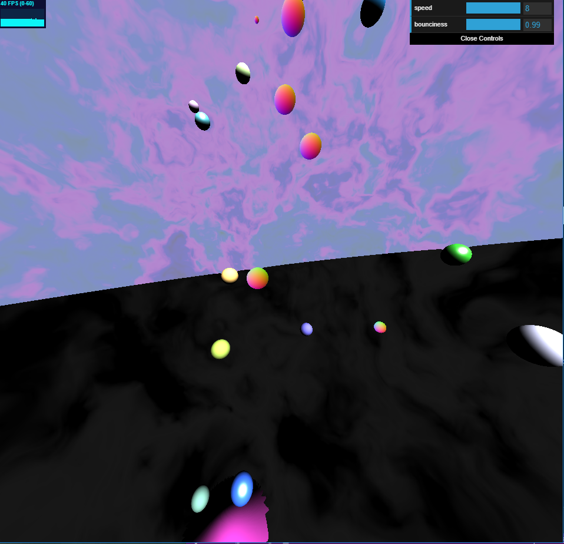

# Homework 2: Raymarched Splatoon
Jake Snipes

PennKey: jsnipes

## Images

Note the splat effects!

What happens when too much energy is lost...

Note all the shading models and interesting textures!

## Techniques
### Paintballs
- Generated with signed distance functions (SDFs) for spheres at arbitrary points
- An explicit bounce function animates their y position
- A sawtooth wave function animates their x position
- At any given time, there are only 25 balls in the scene, but they are moved back periodically to give the illusion of an infinite number
- The paint-like squishing effect was achieved through a combination of smooth blending, subtraction, and intersection functions
- Shading was done using either a Lambertian, Blinn-Phong, or surface normal shading model (chosen at random)

### Sky and Ground
- The ground is generated using a SDF for a plane
- Both are procedurally textured using recursive multi-octave 3D FBM
- Both are colored using a cosine color palette (the ground is grayscale)
- Both textures are animated using time as an input to generate a cloudy/marbled effect

## GUI Controls
- The bounciness of the ground (aka the coefficient of restitution) can be controlled via the "bounciness" slider; I recommend 0.99!
- The initial speed of the paintballs can be controlled using the "speed" slider; I think 4.0 is a nice choice to see all the effects!

## Live Demo
http://jacobsnipes.com/hw02-raymarching-sdfs/

## Resources Used
All resources are cited as comments in the code where they were used
